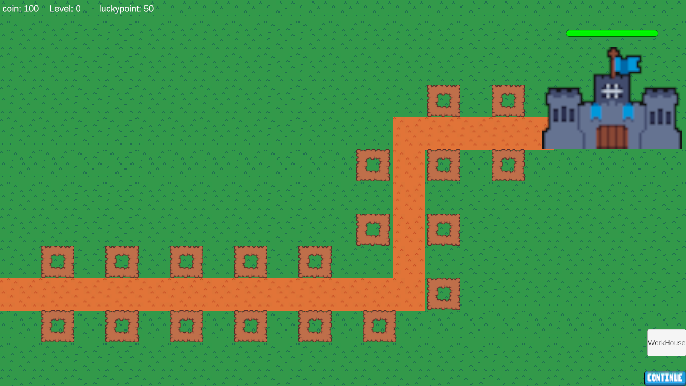
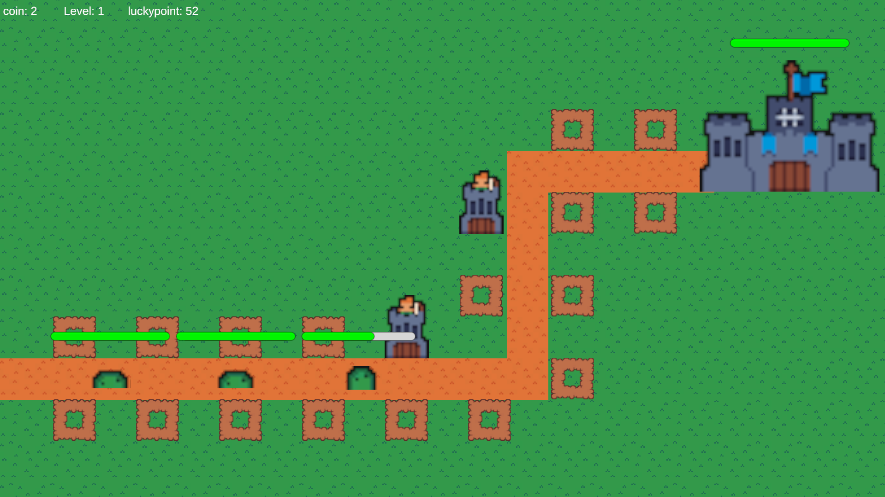
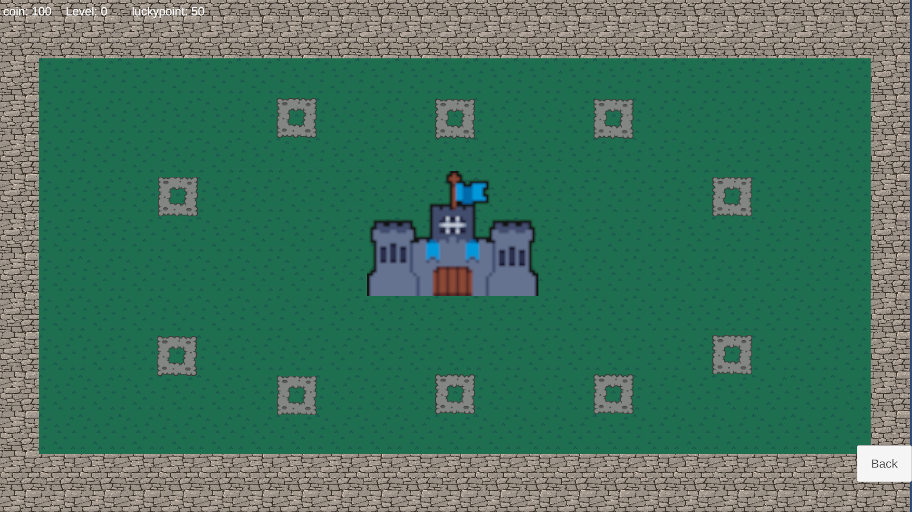
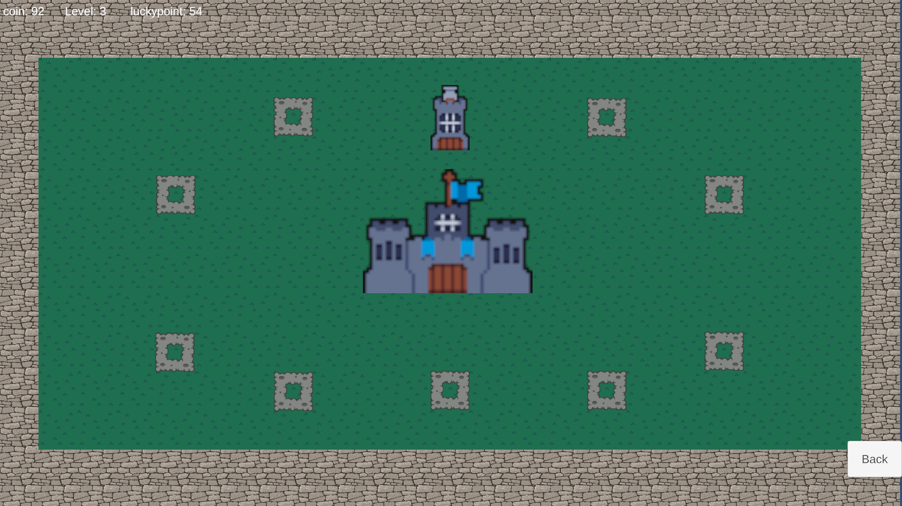

<h1 align="center">🏰 Tower Defense </h1>

  <b>守護你的城堡，建造、升級、抵抗敵人！</b> 
  <i>一款 Unity 製作的 2D 策略塔防遊戲</i>

  
  
  

---

## 📸 遊戲畫面

  
  
  
  
  

---

## 🎮 遊玩方式

- 🏗 點擊建造防禦塔
- 💰 擊殺敵人與時間產金
- ⬆️ 升級塔來提高輸出與範圍
- 🏰 敵人攻破終點會扣血，守住就贏！
- 🍀 全新幸運值機制，越高你的數值就越強!

---

## 🧩 安裝方法

### Windows：

1. 前往 [Releases 頁面](https://github.com/fuuhakugetsurei/Tower_Defense/releases)
2. 下載 `Tower_Defense.zip` 並解壓縮
3. 雙擊 `Tower Defense.exe`開始遊戲！

---

## ⚙️ 開發技術

- 🎮 Unity 6 (6000.0.38f1)
- 🧠 C#
- 🧾 JSON 配置（關卡設定）
- 🎨 Unity UI 系統

---

## 💡 想貢獻？

歡迎開 Issue 或 Fork！任何 UI、音效、塔設計、優化建議都超級歡迎 🔥

---

## 📄 License

MIT License © 2025 fuuhakugetsurei

---

### 🚀 立即下載開始防守！
👉 [點我下載最新版本](https://github.com/fuuhakugetsurei/Tower_Defense/releases/latest)

---

